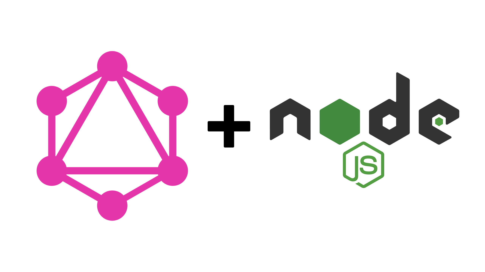

# Demo GraphQL Server with Express

    

## Run the project
1. Move into the app folder:

`cd app`

2. Install dependencies:

`npm install`

3. Run the project if you already have node installed on your machine:

`node index.js`

## Run the project by using Docker

1. Move into the app folder:

`cd app`

2. Install dependencies:

`npm install`

3. Go back to the root folder

`cd ..`

4. Run the command:

`docker run -v $(pwd)/app:/home/node -i -t --workdir /home/node -p 8888:8888 node:18.17.0 bash`

5. Run the server:
`npm start`

## Files Chain
index -> schema -> queries -> types, books